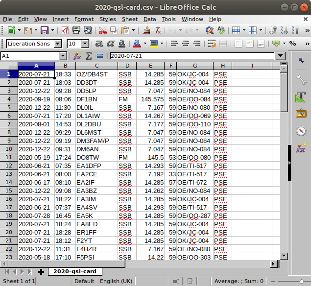
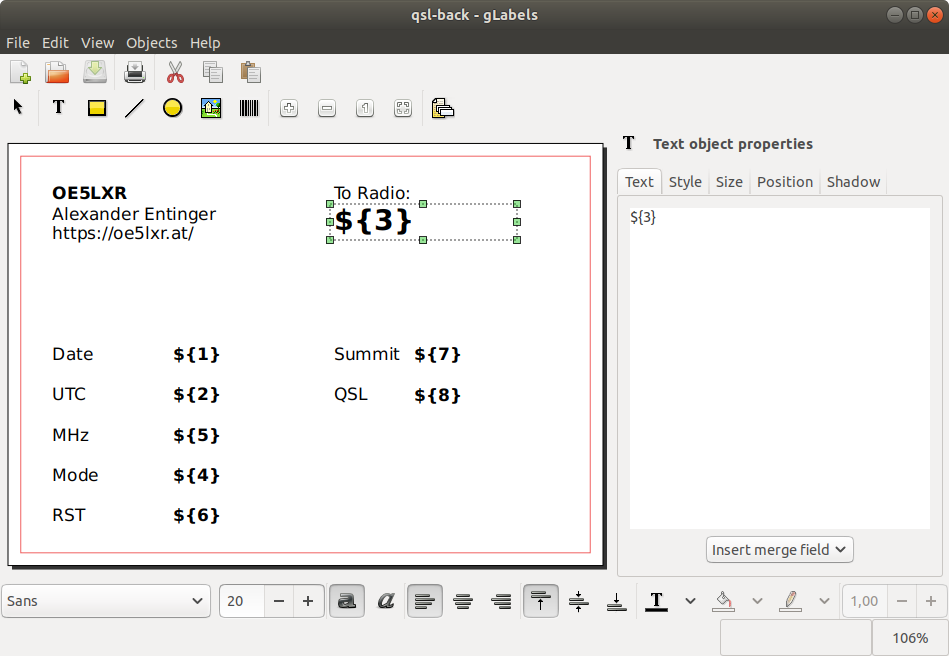
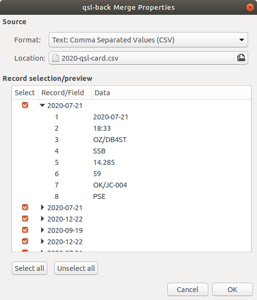
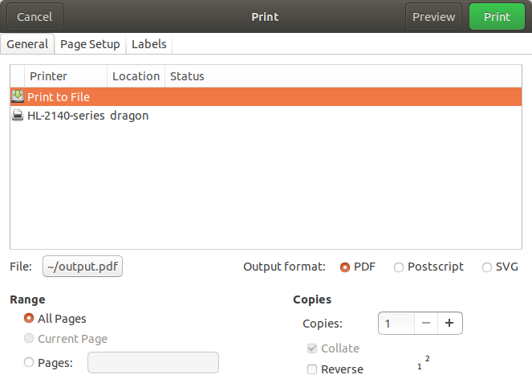

<a href="https://oe5lxr.at/"></a>
QSL card templates for glabel
=============================
This repository contains QSL card templates for usage with glabel.

<p align="center">
  <a href="https://oe5lxr.at/"></a>
</p>

### How to print QSL cards with `glabel`
* Install [glabel](https://github.com/jimevins/glabels-qt)
```bash
sudo apt-get install glabels
```

* Export QSL cards to CSV

<p align="center">
  
</p>

* Open QSL card template (**File -> Open**)

<p align="center">
  
</p>

* Merge properties (**Objects -> Merge properties**)
  * In **Format** select "Text: Comma Separated Values (CSV)"
  * In **Location** select the exported CSV file containing your QSOs

<p align="center">
  
</p>

* Print or export to PDF (**File -> Print**)

<p align="center">
  
</p>
